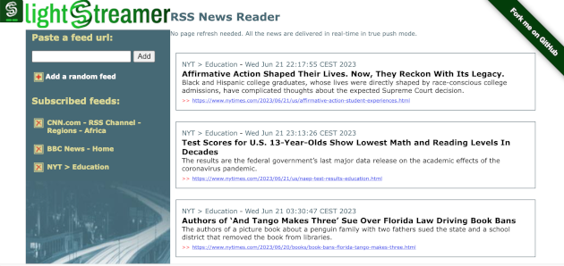

# Lightstreamer - RSS News Demo - HTML Client

<!-- START DESCRIPTION lightstreamer-example-rss-client-javascript -->

This project includes a simple web client front-end example for the [Lightstreamer - RSS News Demo - Java Adapter](https://github.com/Lightstreamer/Lightstreamer-example-RSS-adapter-java).

## Live Demo

[](https://demos.lightstreamer.com/RSSDemo/)<br>
### [ View live demo](https://demos.lightstreamer.com/RSSDemo/)

## Details

The *RSS News Reader Demo* is a simple news aggregator that allows the user to subscribe to several RSS feeds and have the news pushed in real-time without refreshing the page or polling the server under the hood.<br>
This page uses the <b>JavaScript Client API for Lightstreamer</b> to handle the communications with Lightstreamer Server and the demo starts with some feeds already subscribed to. You can add your own feeds or click on "+" to add random feeds.<br>

The demo includes the following client-side functionalities:
* A [Subscription](https://lightstreamer.com/api/ls-web-client/latest/Subscription.html) containing 1 item, subscribed to in <b>DISTINCT</b> mode feeding a [DynaGrid](https://lightstreamer.com/api/ls-web-client/latest/DynaGrid.html) containing the news.
* A [Subscription](https://lightstreamer.com/api/ls-web-client/latest/Subscription.html) containing 1 item, subscribed to in <b>COMMAND</b> mode feeding a [DynaGrid](https://lightstreamer.com/api/ls-web-client/latest/DynaGrid.html) containing the list of feeds currently subscribed to.

<!-- END DESCRIPTION lightstreamer-example-rss-client-javascript -->


## Install

If you want to install a version of this demo pointing to your local Lightstreamer Server, follow these steps:

* Note that, as prerequisite, the [Lightstreamer - RSS News Demo - Java Adapter](https://github.com/Lightstreamer/Lightstreamer-example-RSS-adapter-java) has to be deployed on your local Lightstreamer Server instance. Please check out that project and follow the installation instructions provided with it.
* Launch Lightstreamer Server.
* Get the `lightstreamer.min.js` file from [npm](https://www.npmjs.com/package/lightstreamer-client-web) or [unpkg](https://unpkg.com/lightstreamer-client-web/lightstreamer.min.js) and put it in the `src/js` folder of the demo (if that is the case, please create it).
* Get the `require.js` file form [requirejs.org](http://requirejs.org/docs/download.html) and put it in the `src/js` folder of the demo.

You can deploy this demo to use the Lightstreamer server as Web server or in any external Web Server you are running. 
If you choose the former case, please create the folders `<LS_HOME>/pages/demos/RSSDemo`, then copy here the contents of the `src` folder of this project.<br>
The client demo configuration assumes that Lightstreamer Server, Lightstreamer Adapters, and this client are launched on the same machine. If you need to target a different Lightstreamer server, please search this line:
```js
var lsClient = new LightstreamerClient(protocolToUse+"//localhost:"+portToUse,"RSSDEMO");
```
in `lsClient.js` and change it accordingly. For example, if you want to target the adapter deployed in our online servers, you should substitute with this:
```js
var lsClient = new LightstreamerClient(protocolToUse+"//push.lightstreamer.com","RSSDEMO");
```
<br>
The demo is now ready to be launched.

## See Also

### Lightstreamer Adapters Needed by This Demo Client

<!-- START RELATED_ENTRIES -->
* [Lightstreamer - RSS News Demo - Java Adapter](https://github.com/Lightstreamer/Lightstreamer-example-RSS-adapter-java)
* [Lightstreamer - Reusable Metadata Adapters- Java Adapter](https://github.com/Lightstreamer/Lightstreamer-example-ReusableMetadata-adapter-java)

<!-- END RELATED_ENTRIES -->

### Related Projects

* [Lightstreamer - Basic Chat Demo - HTML Client](https://github.com/Lightstreamer/Lightstreamer-example-Chat-client-javascript)
* [Lightstreamer - Portfolio Demos - HTML Clients](https://github.com/Lightstreamer/Lightstreamer-example-Portfolio-client-javascript)

## Lightstreamer Compatibility Notes

* Compatible with Lightstreamer JavaScript Client library version 6.0 or newer (installation instructions for version 8.0 or newer).
